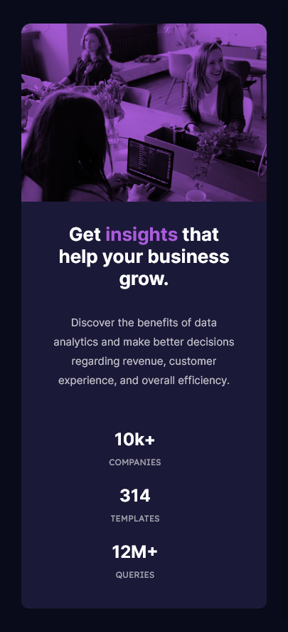
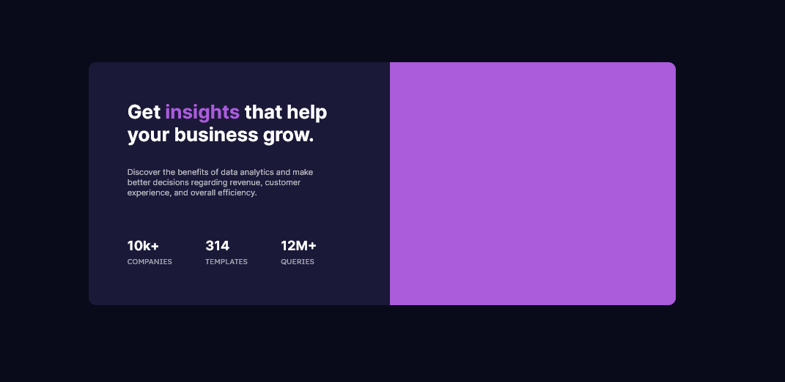

# Frontend Mentor - Stats preview card component solution

This is a solution to the [Stats preview card component challenge on Frontend Mentor](https://www.frontendmentor.io/challenges/stats-preview-card-component-8JqbgoU62).

## Table of contents

- [Overview](#overview)
  - [The challenge](#the-challenge)
  - [Screenshot](#screenshot)
  - [Links](#links)
- [My process](#my-process)
  - [Built with](#built-with)
  - [What I learned](#what-i-learned)
  - [Continued development](#continued-development)
- [Author](#author)

## Overview

### The challenge

Users should be able to:

- View the optimal layout depending on their device's screen size

### Screenshot

<center>


<br/>
Mobile design


<br/>
Desktop design

</center>

### Links

- Solution URL: [Here!](https://github.com/mizek1/stats-preview-card-component/blob/main/index.html)
- Live Site URL: [Here!](#)

## My process

### Built with

- Semantic HTML5 markup
- CSS custom properties
- Flexbox
- Responsive design with media query

### What I learned

I learned how to make responsive designs but I made a mistake of doing the desktop version first. It was really difficult to make all work in the end. I still need to refactor the css and change some things, but it was a good way to practice responsive designs!

Some snippets:

> This is the hardest part for me and I'm really proud that it worked!

```css
@media (min-width: 375px) and (max-width: 1439px) {
  // ...
}
```

> This was funny to do because I had _absolutely no idea_ on how to make this image looks like the prototype:

```css
.card-image {
  background-image: url(images/image-header-desktop.jpg);
  background-color: var(--soft-violet);
  background-blend-mode: multiply;
  background-repeat: no-repeat;
  background-size: cover;
  width: 55%;
  border-radius: 0 10px 10px 0;
}
```

### Continued development

I need to improve CSS codes and make them smaller and reusable.

## Author

- Website - [Danilo Alves](https://github.com/mizek1)
- Frontend Mentor - [@mizek1](https://www.frontendmentor.io/profile/mizek1)
